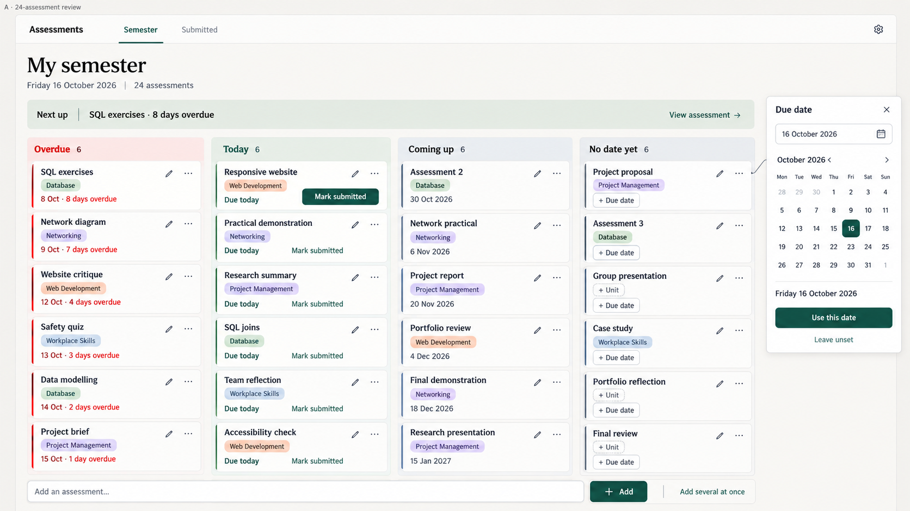

# A案 — 24件の集中時モック

2026-09-12。ユーザー指定の新しい呼称：A案は落ち着いた `b-06-refined-semester-v1.png`、B案は付せんの `b-05-sticky-note-board-v1.png`。従来の製品資料で使う「B再設計」とは別の、今回の見た目比較の呼称。

## 今回まとめた操作

- 課題名だけで追加し、未設定の科目・締切はカード上の+ Unit／+ Due dateから足す。
- Overdue／Today／Coming up／No date yetの4区分。24件がある状態を各区分6件ずつで比較し、画像上でも全24件を確認した。
- 現在日付を見出し直下へ。例示日は2026年10月16日。期限超過は絶対日付と超過日数を併記し、Next upは最古の未提出期限超過を指す。
- 日付ボタンからカレンダーが直接開く。Today／Tomorrowの中間メニューは置かない。テキスト入力例は16 October 2026。年月日と曜日の読み返しを維持する。
- 常設の追加欄、一括入力の第2導線、Semester／Submittedの2つのナビゲーション。PCでは上部、スマホでは先の案同様に下部を想定する。

## 解釈上の注意

右端の余白は24件を隠さず日付ポップオーバーをレビューするためのもの。固定の設定サイドバーやボトムシートではない。実装時はカード近傍に開き、画面端・狭い幅・キーボード操作に対応させる。

Todayの1件だけを強い提出ボタンにしたのは強弱の検討例。すべての未提出カードで提出記録を付けられる操作は必要で、期限が先なら提出できないという制限は設けない。詳細操作の到達方法は採用前に確認する。

英語月名の直接入力、4区分、新しいカード上スロットはまだ現行アプリへ実装していない。今後採用する際も、月別の学期全体、提出履歴・再提出、学校への送信ではない注意書き、ごみ箱・バックアップ・同期安全性を維持する。画像は全機能の仕様書ではない。

24件が各6件という分布は密度確認用の架空例。実際の学生の分布や初見の理解度、支払意思・A$7〜9の価格妥当性は示さない。

組み込みimage_genで生成。全文指示は `a-01-24-assessments-prompt.txt`。モックとメモのみ追加し、アプリ・DB・公開設定は変更していない。
