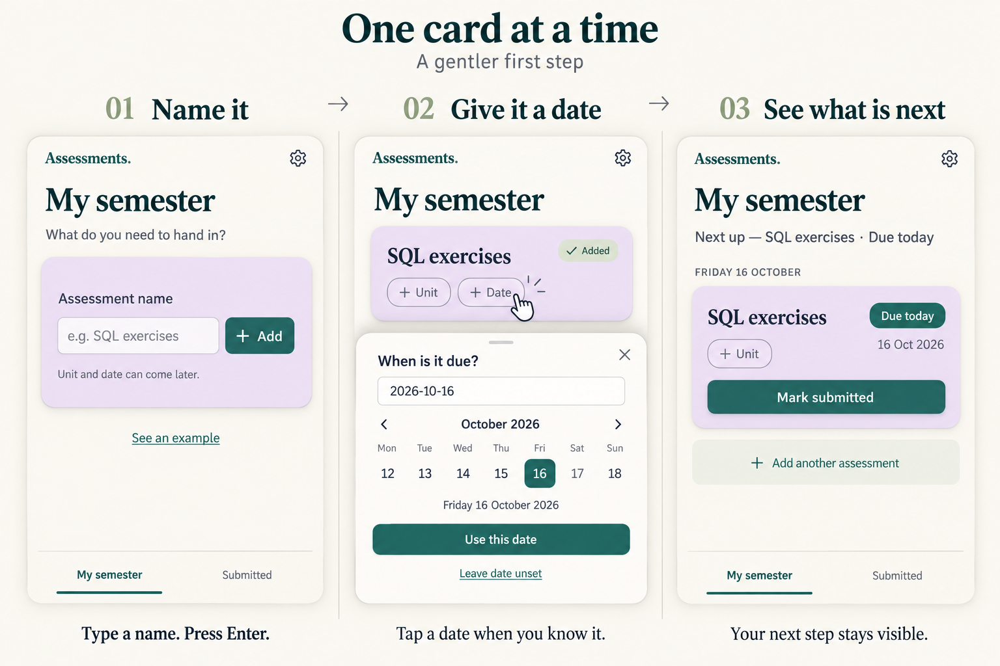

# One card at a time — 操作感のモック

2026-09-12。検討用の提案であり、未採用・未実装。本人が公開前に使い心地を再検討したいため、実クラウド公開準備は判断待ちのまま。

## 狙い

入力欄をカードの形にし、課題名を入力すると、そのカードが自分の課題になる。次の操作はカード上の「+ Unit」「+ Date」。日付を付けると一覧の該当位置へ収まる。入力と結果が同じ場所でつながる感覚を目指す。

ゲームらしさは押した手応え・短い出現／配置アニメーションで表現する案。静止画では動作や理解度は検証できない。ドラッグ必須、経験値、連続利用の罰則などは提案しない。

## 読み方と実装時の注意

- 左：ログイン後の空状態。名前だけで追加でき、見本も開ける。
- 中：追加直後の同じカード。日付は任意であり、この画面を必ず通るという意味ではない。Addedはカード追加の反応で、クラウド保存完了を保証する表示ではない。
- 右：例示日を2026年10月16日とした、今日締切の1件。実アプリでは端末の今日を使う。多数の課題・月別一覧・期限超過はこの1枚には描いていない。
- カレンダーは構図上1週間分を描いた概念図。実装する場合は全日付を選べる既存カレンダーと直接入力、日付の読み返し表示を維持する。
- 学校へ実際に提出する機能ではない。採用時も学校への提出ではない注意書き、再提出履歴、競合・未保存時の保全、ごみ箱・バックアップ、一括入力を維持する。
- 認証の省略やローカル専用モードの採用を意味しない。

画像生成スキルの組み込みimage_genで生成。生成指示は隣の `b-04-first-step-playful-prompt.txt` に保存。アプリのソース・DB・デプロイ設定はこのモック作成で変更していない。
