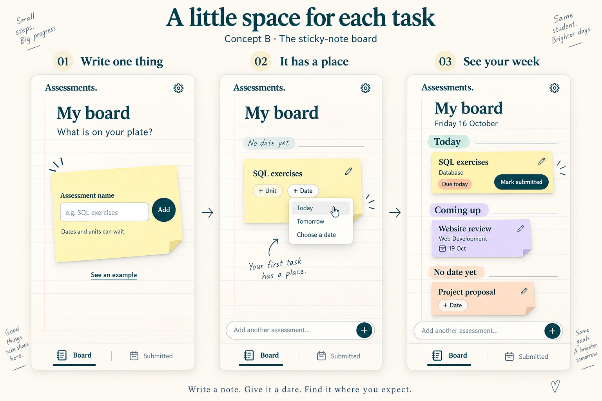

# 付せんボード — 比較用の別案

2026-09-12。未採用・未実装のモック。画像中のConcept Bはこの比較の2案目という意味で、既存の製品方針Bを置き換える決定ではない。

前案は1枚のカードができる手応え、今回は手帳に貼った付せんの置き場所で締切を把握することを重視する。初回は名前だけ。日付を設定するとToday／Coming upへ配置される。ドラッグ必須にはしない。

- 左・中は最初の1件、右は複数登録後の例。画面遷移で勝手に追加カードを生成するわけではない。
- Today／Tomorrowはショートカット候補。採用時も確定する年月日を読み返せる表示を残し、Choose a dateから全日付をカレンダー／直接入力で指定できるようにする。
- 期限超過がある場合はTodayより上にOverdueを表示。学期を見渡す月別表示、一括追加、提出履歴と再提出、学校への送信ではない注意書き、保存・競合・復旧の安全性は維持する。図は全機能を描いた仕様書ではない。
- 手書きの周辺コピーは画像の装飾。実アプリに常設する文章としての提案ではない。
- 見やすさ・直感性は未検証。両案とも静止画のため、動作の手応えは別途検証が必要。

画像生成スキルの組み込みimage_genで生成。指示全文は `b-05-sticky-note-board-prompt.txt`。今回はモックとメモのみ追加し、アプリ・DB・公開設定は変更していない。
