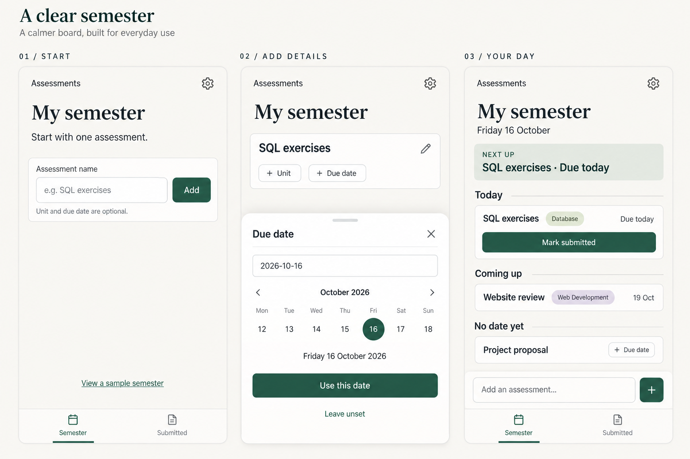

# A clear semester — 落ち着いた道具としての別案

2026-09-12。未採用・未実装の比較用モック。ユーザーは付せん案の操作・分類を好む一方、チープな印象と手書き説明を除き、少額有料化を見据えて造形を再検討したい。

## 今回の方針

- 課題名だけで開始し、科目・締切はカード上から任意に追加。前案の分かりやすい操作を継承。
- 手書き、折れた紙、傾き、装飾的な付せんを廃し、白い面・細い境界線・揃った文字と余白に整理。
- 濃いグリーンは主要操作、淡い色は科目識別に限定。課題が増えた場合にも読み取りやすい、コンパクトな行を使う。
- 今日・今後・期限未定の分類を維持。今日取り組む課題を上で明示する。

## 静止画の解釈

初回・詳細入力・複数件入力後の例を並べたもので、日付入力が必須という意味ではない。カレンダーは構図上1週間を描くが、採用時は全日付を選べる既存カレンダー／直接入力／年月日の読み返しを維持する。Todayは例示日の2026年10月16日を使用。

Overdue最上段、月別の学期全体、一括追加、提出と再提出、学校への送信ではない注意書き、履歴・クラウド同期・競合・復元の安全性は仕様として維持する。今回はその全画面を描いていない。カード上に表示する情報量とNext upの重複は、採用前に初見評価で確認する。

有料利用につながるかは見た目だけでは確認できない。継続して役立つこと、迷わず操作できること、支払意思を別途評価する。価格・課金実装の決定はしていない。

画像生成スキルの組み込みimage_genで生成。指示全文は `b-06-refined-semester-prompt.txt`。このターンはモックとメモだけを追加し、アプリ・DB・公開設定は変更していない。
